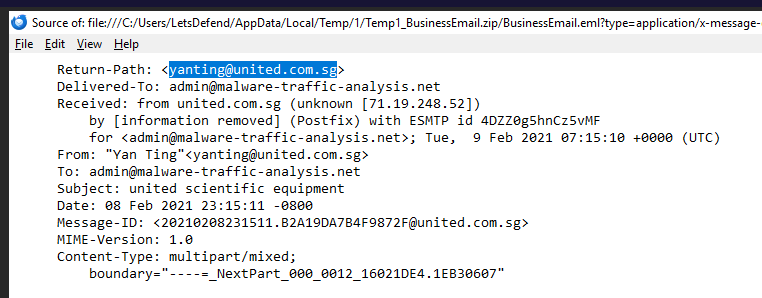
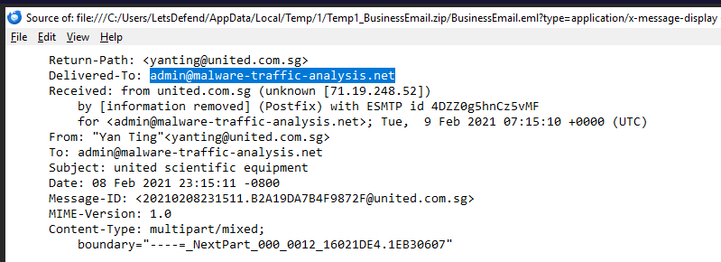
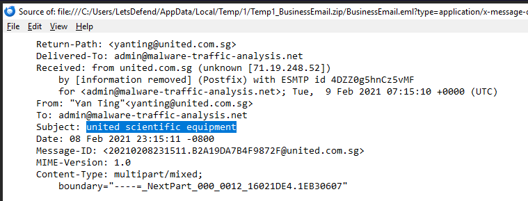
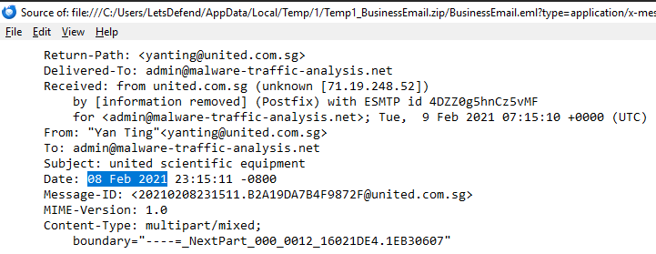
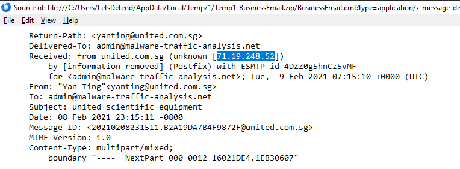
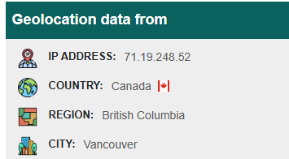
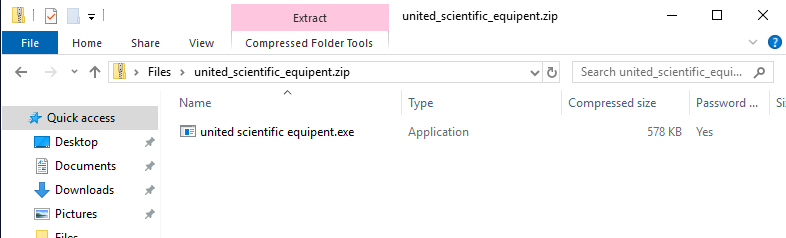
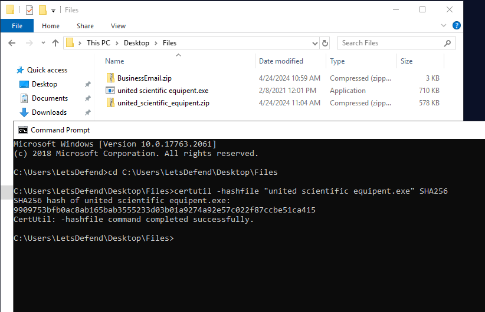

# Investigation Report – United Scientific Equipment Impersonation Email

**Analyst:** Olga Zaytseva  
**Date:** 05.08.2025  
**Platform:** Let’s Defend – Phishing Email Challenge  
**Scenario:** A suspicious email was received from a domain resembling a legitimate company. The email contained a ZIP attachment, which, upon extraction, revealed an `.exe` file. The goal was to determine whether the email was malicious and extract relevant Indicators of Compromise (IOCs).

---

## 1. Email Metadata Review

### 1.1 From, To, Subject, and IP
- **From:** `yanting@united.com.sg`  
- **To:** `admin@malware-traffic-analysis.net`  
- **Subject:** `united scientific equipment`  
- **Date:** 02/08/2021  
- **Originating IP:** `71.19.248.52`  

---

## 2. IP Reputation & Geolocation

### 2.1 IP Lookup Result  
**IP:** `71.19.248.52`  
**Location:** Canada

**Analysis:**  
Although the domain appears to belong to a legitimate Singapore-based company (`united.com.sg`), the originating IP address resolves to **Canada**, which raises a red flag. This mismatch is a common trait in phishing campaigns using compromised or spoofed email infrastructure.  
A Singapore-based company sending mail from a Canadian IP suggests potential spoofing or relay abuse. Legitimate companies typically send email from geolocations consistent with their registered domain.

---

## 3. Attachment Inspection

### 3.1 Extracted File Details  
**Zipped Attachment:** `united_scientific_equipent.zip`  
**Unzipped Filename:** `united scientific equipent.exe` *(note the typo)*

**Analysis:**  
The extracted `.exe` file contains a typo ("equipent" instead of "equipment"), a tactic often used by attackers to evade detection filters and confuse users into clicking.

---

## 4. SHA-256 Hash & Malware Check

### 4.1 Hash Generation via CMD

Command used in Windows CMD:

certutil -hashfile "united scientific equipent.exe" SHA256

---

### 4.2 VirusTotal Result
SHA-256:
9909753bfb0ac8ab165bab3555233d03b01a9274a92e57c022f87ccbe51ca415

**Analysis:**
The executable was submitted to VirusTotal and flagged by multiple antivirus engines as malware. This confirms the attachment is malicious and was likely intended to infect the recipient upon execution.

---

## 5. Final Verdict
**Is this email a phishing attempt?**
**Yes.**

### Indicators:
- Legitimate-looking sender domain, but originating from unrelated IP
- Suspicious attachment with a misleading filename
- Malware-laced executable confirmed by hash reputation
- No clear context or personalization in message content
- Common impersonation tactic targeting businesses with fake equipment/invoice themes

