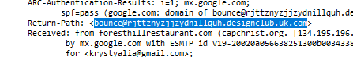

# Investigation Report – German PayPal Phishing Email

**Analyst:** Olga Zaytseva  
**Date:** 05.01.2025  
**Platform:** Let's Defend – Phishing Email Challenge  
**Scenario:** User's email address was leaked, and a suspicious email spoofing PayPal in German was received. The goal is to investigate and determine whether the email is a phishing attempt.

---

## 1. Email Metadata Review

### 1.1 Return-Path
**Return-Path:**  
bounce@rjttznyzjzjydnillquh.designclub.uk.com

**Analysis:**  
The domain `designclub.uk.com` is not affiliated with PayPal and appears randomly generated (`rjttznyzjzjydnillquh`). This is a common sign of mass phishing operations using domain shadowing or subdomain abuse.

---

## 2. URL and Link Analysis

### 2.1 Link Extracted from Email Body
**Decoded Target Domain:**  
storage.googleapis.com

**How Found:**  
The HTML source of the email was manually reviewed. The clickable button contained an obfuscated link, which was base64-decoded and revealed a redirection to a file hosted on `storage.googleapis.com`.

**Note:**  
While `storage.googleapis.com` is a legitimate Google Cloud storage domain, attackers often abuse public file hosting to serve phishing pages.

---

## 3. Domain Reputation Check

### 3.1 VirusTotal Report  
**Result:**  
The `storage.googleapis.com` link used in the email was flagged by **VirusTotal** as hosting phishing content.

**Conclusion:**  
Although the domain itself is legitimate, the hosted **object (http://storage.googleapis.com/hqyoqzatqthj/aemmfcylvxeo.html)** was **malicious**.

---

## 4. Email Body Hash

### 4.1 SHA-256 Hash
13945ecc33afee74ac7f72e1d5bb73050894356c4bf63d02a1a53e76830567f5

**Purpose:**  
Used to compare with other phishing emails and identify known campaign variants in tools like VirusTotal or internal threat intel repositories.

---

## 5. Final Verdict

**Is this email a phishing attempt?**  
**Yes.**

### Indicators:
- Spoofed sender with random subdomain (`designclub.uk.com`)
- German-language urgency scam (targeting local victims)
- Obfuscated and malicious link
- File hosted on `storage.googleapis.com` marked as phishing
- VirusTotal confirms phishing behavior
- No personalization, poor sender hygiene

